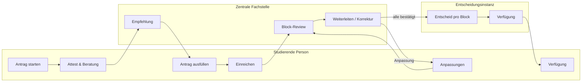

# Beschreibung der konzipierten NTA-Tool-Lösung (Prototyp «avalis»)

> **Zweck:** Konzeptionelle Beschreibung aus **Nutzer- und Organisationssicht** (nicht technisch) — als Kontext für Research-Auswertungen, z. B. Kapitel «Implikationen für die Lösungsgestaltung».  
> **Verwandt:** `General_Prototype_Kontext.md`, `Prototyp_Funktionen.md`, `Antragerstellung_Kontext.md`, `Antrag_Review_Kontext.md`, `Antrag_Bewilligung_Kontext.md`, `Dashboard_Core_Layout_Kontext.md`.

---

## 1. Zweck und Problemraum

### Was das Tool adressiert

An Schweizer Hochschulen beantragen studierende Personen einen **Nachteilsausgleich (NTA)** — angepasste Studien- und Prüfungsbedingungen wegen gesundheitlicher Beeinträchtigungen. Der Prozess ist **mehrstufig**, **rollenübergreifend** und oft **asynchron**: medizinischer Nachweis, Beratung, formale Antragstellung, fachliche Prüfung, ggf. Korrekturrunden und schliesslich eine **verbindliche Entscheid** (Verfügung).

Typische Probleme ohne integriertes Tool:

- **Fragmentierte Kommunikation** (E-Mail, PDFs, parallele Systeme)
- **Unklarer Status** für Antragstellende («Wo steht mein Antrag?»)
- **Koordinationsaufwand** zwischen zentraler Fachstelle, Fakultät/Entscheidungsinstanz und weiteren Stellen
- **Wiederholte Dateneingabe** und schwer nachvollziehbare **Versionsstände** nach Korrekturen
- **Fehlende Transparenz**, wer wann was bearbeitet hat

### Was die Lösung leisten soll

Eine **digitale End-to-End-Plattform**, die den NTA-Prozess für alle Beteiligten **in einem gemeinsamen Fall («Antrag»)** abbildet: von der Erstanmeldung bis zur ausgestellten Verfügung — inklusive Beratung, Empfehlung, Review, Anpassungsrunden und Entscheid.

Der vorliegende Prototyp ist ein **forschungs- und testorientiertes Simulationsinstrument** (Bachelor HSLU), kein Produktionssystem — er modelliert aber bewusst einen **realistischen, durchspielbaren Gesamtprozess**.

### Organisationsmodell im Fokus

Der Prototyp priorisiert **Prozessmodell Typ A**:

- **Zentrale NTA-Fachstelle** (Beratung, Empfehlung, fachliche Vorprüfung / Review)
- **Dezentrale Entscheidungsinstanz** (z. B. fakultätsbezogene Bewilligung)

Das entspricht gängigen Mustern an Universitäten mit zentraler Koordination und dezentraler Entscheidungskompetenz.

---

## 2. Nutzergruppen und Rollen

| Rolle | Wer | Hauptaufgaben im Tool |
|--------|-----|------------------------|
| **R1 — Studierende Person** | Antragstellende | Antrag anlegen, Daten/Attest hochladen, Beratungstermin buchen, Empfehlung zur Kenntnis nehmen, Antrag ausfüllen und einreichen, bei Rückfragen **gezielt Blöcke anpassen**, Status verfolgen, ausgestellte Verfügung einsehen |
| **R2 — Zentrale Fachstelle** | NTA-Fachstelle / Studium & Behinderung | Beratungstermine einsehen, **Empfehlungsschreiben** verfassen und freigeben, nach Einreichung **Block-für-Block prüfen** (bestätigen oder Anpassung anfordern), Antrag an Entscheid weiterleiten oder zur Korrektur zurückgeben |
| **R3** | Weitere Workspace-Rolle (Prototyp) | In Policies mit R2 gruppiert; fachliche Entscheid-Simulation teils an R4 ausgelagert |
| **R4 — Entscheidungsinstanz** | Fakultät / zuständige Entscheidungsstelle | Antrag in Entscheidungsphase **bewilligen oder ablehnen** (pro Block: Massnahmen, Geltungsbereich, Dauer), Massnahmen **konkretisieren**, bei Ablehnung **begründen**, **Verfügung generieren** und Entscheid fällen; fakultätsbezogene Sichtbarkeit möglich |
| **R2R4** | Kombinierte Testrolle | Ein Account simuliert Fachstelle **und** Entscheid — für Usability-Tests ohne Rollenwechsel |
| **R5 — Prüfungsadministration** | Prüfungsbüro | (Zielbild) Massnahmenlisten pro Prüfung, Umsetzung organisieren — im Prototyp reduziert |
| **R6 — Modulverantwortliche** | Lehrende / Modulkoordination | (Zielbild) Massnahmen für eigene Module einsehen **ohne** medizinische Details — im Prototyp reduziert |

**Zwei getrennte Einstiegswelten:**

- **Studierenden-Portal** — persönlicher Antragsweg, «Meine Anträge»
- **Verwaltungs-Workspace** — Inbox, Aufgaben, Beratungsplanung, Review und Entscheid

Logins sind im Prototyp **inszeniert** (optisch wie Hochschul-SSO), technisch aber einfache Konten für Tests.

---

## 3. Gesamtprozess (End-to-End)

### Phase 1 — Antragserstellung (R1)

**Schritt 1 — Persönliche Angaben:** Identität, Kontakt, Studiengang, Semester, Antragsart (laufendes Studium vs. Aufnahmeverfahren).

**Schritt 2 — Fachärztliches Attest:** Upload (ICF-orientiert: Diagnose, studienrelevante Auswirkungen, Massnahmenempfehlungen).

**Schritt 3 — Beratung & Empfehlung:**

- R1 bucht einen **Beratungstermin** (im Prototyp: Kalender-Mock, fester Ort).
- Der Fall erscheint bei R2.
- Nach dem Gespräch verfasst R2 ein **Empfehlungsschreiben** (formeller Text, nicht von R1 geschrieben) und **gibt es frei**.
- R1 liest die Empfehlung, bestätigt **Kenntnisnahme** — erst dann werden die Antrags-Schritte freigeschaltet.

**Schritt 4 — Antragsstellung:** Beschreibung der gesundheitlichen Situation und Nachteile im Studium; **Gültigkeitsdauer**; **Geltungsbereich** (z. B. schriftliche/mündliche Prüfungen, Lehrveranstaltungen); **Ausgleichsmassnahmen** für Lehrveranstaltungen und Leistungsnachweise (Katalog + «Sonstige»-Freitext).

**Schritt 5 — Übersicht & Einreichung:** Gesamtprüfung, Nutzungsbedingungen, **finale Einreichung** → Status **«In Review»**.

Nach der Beratungsbuchung sind **persönliche Stammdaten** in späteren Schritten **nicht mehr editierbar** (Stabilität des Falls).

### Phase 2 — Fachstellen-Review (R2)

Nach Einreichung prüft R2 den Antrag **blockweise** (nicht Feld-für-Feld):

1. Antragstellende Person  
2. Attest  
3. Empfehlungsschreiben (read-only, sobald freigegeben)  
4. Situationsbeschreibung  
5. Gültigkeitsdauer  
6. Geltungsbereich  
7. Massnahmen LV / Leistungsnachweise  

Pro Block: **Bestätigen** oder **Anpassung anfordern** (mit **Pflichtbemerkung**).

- **Alle Blöcke bestätigt** → **«Antrag weiterreichen»** → Status **«In Entscheid»** (Entscheidungsinstanz übernimmt).
- **Mind. eine Anpassung** → **«Anpassungen weiterleiten»** → R1 erhält **«Anpassung erforderlich»**.

### Phase 3 — Korrektur-Loop (R1 ↔ R2)

- R1 sieht dieselbe **Block-Struktur** wie die Fachstelle, bearbeitet **nur** angeforderte Blöcke.
- Anpassungen werden **gespeichert** und in einer **Chronik** sichtbar («Angepasst» vs. offen).
- Wenn alle angeforderten Anpassungen erledigt sind: **«Anpassungen für Review freigeben»** → zurück zu **«In Review»**.
- R2 kann erneut prüfen; bei Re-Review gibt es **Aktuell/Verlauf** (Vergleich alter und neuer Fassung mit der ursprünglichen Anforderung).

Der Loop wiederholt sich, bis R2 alles bestätigt und weiterreicht.

### Phase 4 — Entscheid (R4)

In **«In Entscheid»** / **«Entscheid erforderlich»** (R4-Perspektive):

- **Informationsblöcke** (Person, Attest, Empfehlung, Situation) sind als **von Fachstelle bestätigt** markiert — nicht erneut bewilligbar.
- **Entscheidungsblöcke:** Gültigkeitsdauer, Geltungsbereich, Massnahmen LV und Leistungsnachweise.
- R4 entscheidet pro Option/Zeile per **Schalter** (bewilligen / ablehnen / ggf. **eigene Massnahme hinzufügen**).
- Bei Massnahmen: nach Auswahl **konkretisieren** (Titel und Beschreibung für die Verfügung).
- Bei vollständiger Ablehnung eines Blocks: **Begründung** erforderlich.
- Wenn alle Blöcke entschieden: **Verfügung generieren** (Vorschau aus Antragsdaten + Entscheid) → **Entscheid fällen** → **Bewilligt** oder **Abgelehnt**.

### Phase 5 — Ausgestellte Verfügung (alle relevanten Rollen)

- **R1, R2, R4** sehen die **ausgestellte Verfügung** als zentrales Dokument.
- **Zugehörige Dokumente** (Attest, Empfehlung) bleiben in der Sidebar zugänglich, ohne die Hauptansicht zu überladen.
- Bei Ablehnung: zusätzlich **abgelehnte Blöcke mit Begründung** unter der Verfügung.

---

## 4. Statusmodell (gemeinsame Sprache)

Alle Rollen teilen **einen kanonischen Verlauf**, mit **rollenspezifischen Bezeichnungen** wo sinnvoll:

| Fachlicher Zustand | Bedeutung (kurz) | Typische Sicht R1 | Typische Sicht R2/R4 |
|--------------------|------------------|-------------------|----------------------|
| **Entwurf** | Antrag noch nicht final eingereicht | Ja | Nein / irrelevant |
| **Beratung & Empfehlung** | Termin gebucht bis Empfehlung freigegeben | Wartet auf / liest Empfehlung | Beratung planen, Schreiben freigeben |
| **In Review** | Final eingereicht, Fachstelle prüft | Read-only oder wartet | Block-Review aktiv |
| **Anpassung erforderlich / ausstehend** | R2 hat Korrekturen verlangt | Bearbeitung möglich | Wartet auf R1 |
| **In Entscheid** | An Entscheidungsinstanz weitergeleitet | Read-only, Fortschritt sichtbar | R2 read-only; R4 entscheidet |
| **Bewilligt / Abgelehnt** | Verfügung ausgestellt | Ergebnis + Dokumente | Abschluss, Nachvollziehbarkeit |

R1-Dashboard zeigt einen **vereinfachten Fortschritt** (z. B. In Review → In Entscheid → Verfügung).

---

## 5. Zentrale Funktionsprinzipien (lösungsrelevant)

### 5.1 Ein Fall, viele Perspektiven

Ein Antrag ist die **gemeinsame Wahrheit**. Aktionen einer Rolle **ändern sichtbar den Zustand** für andere (Status, Inhalte, Aufgaben). Das ist explizites Designziel des Prototyps: **Multi-Stakeholder-Simulation** schlägt isolierte Einzelfeatures.

### 5.2 Block- statt Formular-Logik in Prüfung und Entscheid

Review und Bewilligung arbeiten mit **inhaltlichen Blöcken** (Attest, Situation, Massnahmen …), nicht mit anonymen Formularfeldern. Das spiegelt **fachliche Prüfpraxis** und erleichtert **gezielte Rückfragen** und **Teilentscheide**.

### 5.3 Asynchrone, schriftliche Koordination

Beratung kann real vor Ort stattfinden; im Tool läuft die **Empfehlung** und das **Review** **asynchron** (Entwurf speichern, freigeben, später weiterarbeiten). R1 muss nicht permanent online sein, wenn R2 arbeitet — Status und Benachrichtigungs-Inszenierung (Inbox/Banner) kommunizieren den Fortschritt.

### 5.4 Freischaltung und Abhängigkeiten

Der Antragsweg ist **linear mit klaren Gates**: ohne freigegebene Empfehlung keine Antragsstellung; ohne finale Einreichung kein Review; ohne abgeschlossenes Review keine Entscheid. Das reduziert **unvollständige Anträge** in späteren Phasen.

### 5.5 Trennung Empfehlung vs. Entscheid

- **Empfehlung (R2):** beratend, für R1 verbindlich im Sinne des Prozess-Schritts, aber **keine Verfügung**.
- **Entscheid (R4):** **rechtsverbindliche** Ausgestaltung (was bewilligt/abgelehnt wird, konkretisierte Massnahmen, Verfügungstext).

### 5.6 Nachvollziehbarkeit und Verlauf

- Bemerkungen und Chronik pro Block (Review, Anpassung).
- Re-Review mit **Vergleich** (aktuell vs. vor Anpassung).
- Entscheid-Snapshot bleibt erhalten; bei Bewilligung werden genehmigte Inhalte in den **sichtbaren Antrag** übernommen.

### 5.7 Arbeitsunterstützung für Verwaltung

**Workspace** mit:

- **Home:** KPI-Karten (offene Verfahren, zugewiesene Aufgaben, anstehende Beratungen) + filterbare Antragsliste.
- **Meine Aufgaben:** persönliche Bearbeitungsliste.
- **Beratungen planen:** Kalender- und Listenansicht gebuchter Termine.
- **Zuweisung** («Zugewiesen an») und **Fakultäts-Scope** für R4.

### 5.8 Studierenden-Orientierung

- **Onboarding** beim neuen Antrag (Prozessphasen erklären).
- **Dashboard** mit Karten/Tabellen und klarem Status.
- **Zwei Modi:** geführter **Step-Flow** (Erstellung) vs. **Detailansicht** (nach Einreichung / bei Korrektur / Verfügung).

---

## 6. Leitprinzipien der Lösungsgestaltung (für Implikations-Kapitel)

1. **Prozessorientierung statt Formular-Abwicklung:** Das Tool modelliert einen **regulierten Mehrparteien-Prozess**, nicht nur ein Online-Formular.

2. **Rollenklarheit mit gemeinsamem Objekt:** Jede Rolle hat eigene Aufgaben, arbeitet aber am **selben Antrag** mit konsistentem Status.

3. **Phasenweise Verantwortung:** Beratung → Review → Entscheid sind **getrennte Verantwortungsübergänge** mit expliziten Übergabeaktionen («freigeben», «weiterreichen», «Entscheid fällen»).

4. **Kontrollierte Rückkopplung:** Korrekturen sind **strukturiert** (nur angeforderte Blöcke, Freigabe zurück an Fachstelle), nicht beliebiges Hin-und-Her per E-Mail.

5. **Transparenz für Antragstellende:** Status, Fortschritt und Ergebnis (Verfügung) sind **im Portal** erreichbar — entlastet Nachfragen an die Fachstelle.

6. **Skalierung der Verwaltung:** Inbox, Filter, KPI, Aufgaben-Buckets und Terminplanung adressieren **Volumen und Koordination** an der Fachstelle.

6b. **Institutionelle Auswertung (Prototyp-Zielbild):** An Hochschulen fehlt oft ein **zentrales NTA-Reporting** über alle Anträge. Der Workspace-Screen **«Auswerten»** (`/workspace?view=auswerten`) zeigt für die Fachstelle aggregierte Kennzahlen (Status, Fakultät, Massnahmen, Bearbeitungsdauer, zeitliche Peaks) — im Prototyp auf **UZH-plausible Mock-Daten** (`workspace-evaluate-mock.json`), nicht auf Live-DB. Dient Planung, Berichten und Prozessverbesserung; technische Details → `Dashboard_Core_Layout_Kontext.md` § 5c.

7. **Dezentrale Entscheidung mit zentraler Vorarbeit:** Fachstelle **qualifiziert und filtert**; Entscheidungsinstanz fokussiert auf **bewilligungsrelevante Blöcke** und Verfügungserstellung.

8. **Datenschutz und Need-to-know (Zielbild R5/R6):** Spätere Rollen sollen Massnahmen für Umsetzung sehen **ohne** unnötige medizinische Tiefe — im Prototyp angelegt, noch nicht voll ausgebaut.

---

## 7. Kurzprofil für LLM-Prompting

**Ein-Satz-Beschreibung:**  
*«avalis» ist eine konzeptionelle Webplattform für den schweizerischen Hochschul-Nachteilsausgleich: Studierende durchlaufen einen geführten Antrags- und Beratungsprozess; die zentrale Fachstelle erstellt Empfehlungen und führt ein strukturiertes Block-Review mit optionalen Korrekturrunden durch; die Entscheidungsinstanz bewilligt oder lehnt blockweise ab, konkretisiert Massnahmen und stellt eine Verfügung aus — alles in einem gemeinsamen, statusbasierten Fall mit getrennten Portal- und Workspace-Perspektiven.*

**Kernprobleme, die die Lösung adressiert:** Koordination über Rollen hinweg · Status-Transparenz · strukturierte Rückfragen · Trennung Beratung/Empfehlung vs. Verfügung · Reduktion Medienbrüche · Nachvollziehbarkeit bei Wiederholungszyklen.

**Kern-Flows zum Abgleich mit Research:** Antragserstellung (5+1 Schritte) · Beratung & Empfehlung · Review/Forward · Korrektur-Loop · Entscheid & Verfügung · Ausgestelltes Ergebnis · **Auswerten (Fachstelle, Mock)**.
